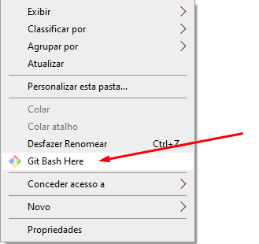
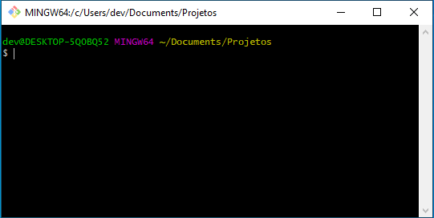
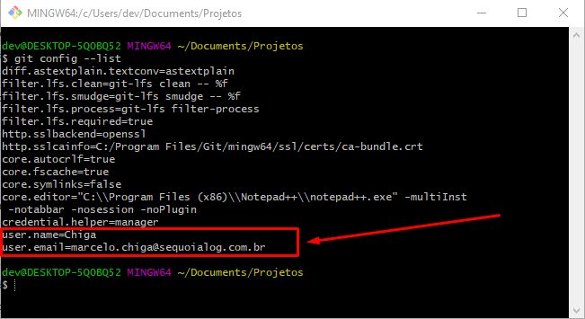

# Configurando o Git
-----
<br>

> **Com o botão direito do mouse em uma pasta de Projetos clique em "Git Bash Here" conforme a imagem abaixo:**
> 
> 

> **Com o bash aberto começaremos a digitar as configurações**
>
> 


* Git global setup:
  ```bash
  $ git config --global user.name 'seuNome' [Enter]
  $ git config --global user.email 'seuEmail' [Enter]
  $ git config --global mergetool.p4merge.path 'C:Program Files\Perforce\p4merge.exe' [Enter]
  $ git config --global merge.tool p4merge [Enter]
  ```
<br>

* Para verificar se seu Nome e Email estão configurados digite:
  ```bash
  $ git config --list
  ```


<br>

