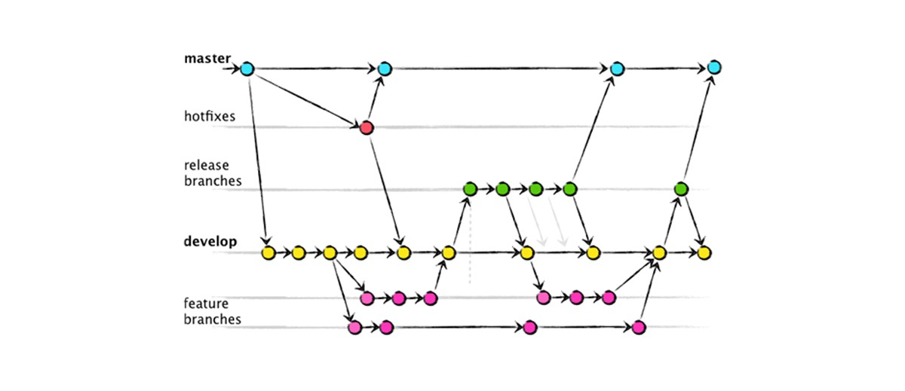

<br>
<br>

# Iniciando com o Git
---
<br>

## Para iniciar um novo projeto.
  ```bash
  $ git init
  $ git add .
  $ git commit -m "first commit"
 
  $ git remote add origin git.empresa.com.br/Dev/projeto_teste.git
  $ git push -u origin develop/master
  ```
  <br>

### Lembre-se, quando iniciar um novo projeto não esqueça:

    1.  Crie o arquivo .gitignore
    2.  Crie uma Tag de versionando semântica Ex.: v1.0.0
    3.  Crie um arquivo README.md para facilitar outros desenvolvedores com informações importantes do projeto
   
<br>

## Clonando um repositório
  ```bash
  $ git clone <repositório>
  ```
<br>

## Criando uma nova Branch a partir da branch que você está
  ```bash
  $ git branch
  $ git checkout -b new-feature
  ```
<br>

## Git pull 
**Tenha o hábito de todos os dias quando for começar seu trabalho fazer um PULL ( buscar alterações remotas ) isso vai garantir que seu código fonte esteja sempre atualizado.**
  ```bash
  $ git pull
  $ git fetch origin master
  ```

<br>

# Esta imagem representa o Fluxo de trabalho pelo Git
---
<br>


<br>


# Vamos entender como funciona cada um deles:

## Workspace

> É o local onde trabalhamos e neste local o **Git** entende que os arquivos não foram rastreados pelo Git ainda, chamados de **untracked files** 
> 
  ```bash
  $ git status
  ```

  ```bash
  2. Arquivos não rastreado
  ```

  ```bash
  $ "git add" to track
  ```

 

<br>

## Stagind index
> É o local onde começamos a rastrear os arquivos para serem versionados
> 
  ```bash
  $ git add.
  ```

  ```bash
  $ git status
  ```

  ```bash
  3. Mudanças prontas para serem comitadas
  ```

```bash
  $ "git rm --cached <file>..." to unstage
  ```


<br>

## Local repository
> Este é seu repositório **local** onde ficam seus códigos
  
  ```bash
  $ git commit -m 'breve explicação do que foi feito'
  ```

  ```bash
  $ git status
  ```


<br>

## Remote repository
> Este é o **repositório remoto** onde somente após você terminar e testar sua feature poderá enviar

  ```bash
  $ git push -u origin develop
  ```


<br>
<br>

# Branches
---
<br> 



<br>

## Geralmente usamos 2 branches fixas:
  ```bash
  * master
  * develop
  ```

A **master** é o código que está em produção.

A **develop** é onde todo o fluxo de trabalho irá ocorrer e deve sempre conter o código mais atual, onde as branchs de features serão ramificadas tendo ela como base.


## Branches de suportes ( voláteis ) que são deletadas após o uso
  ```bash
  * feature    
  * release
  * hotfix
  ```
<br>  

* **feature**
Para novas implementações
  * Sempre nomear desta forma: **feature/novo-relatorio**

<br>

* **release**
Para finalizar o release e tags
  * Sempre crie uma Tag

<br>

* **hotfix**
Para resolver problema crítico em produção que não pode esperar novo release
  * Sempre nomear desta forma: **hotfix/link-nao-funciona**
  * Sempre crie uma Tag

<br>  

# Um exemplo de uso:
* Primeiro vamos verificar se estamos na branch de **desenvolvimento**
  ```bash
  $ git branch
  ```
<br> 

* Agora vamos criar nossa nova **feature**  
  ```bash
  $ git checkout -b feature/novo-relatorio    
  ```
<br> 

* Se necessário você pode compartilhar sua branch para que outra pessoa possa trabalhar nesta mesma implementação
  ```bash
  $ git push origin feature/novo-relatorio    
  ```
<br>

* Após finalizar sua implementação, vamos fazer o merge desta feature com a develop
  ```bash
  $ git checkout develop
  ```
<br>

* Faça o merge da feature
  ```bash
  $ git merge feature/novo-relatorio
  ```
<br>

* Por último atualize o repositório remoto
  ```bash
  $ git push origin develop
  ```
<br>

* Caso não ocorra nenhum conflito, vamos preparar o release desta implementação e enviar para o repositório remoto.
* Criando a branch de **release**
  ```bash
  $ git checkout -b release/v1.1.0
  ```
<br>

* Enviando para o repositório remoto
  ```bash
    $ git push origin release/v1.1.0
  ```
<br>

* Depois dos testes criaremos a **tag** da versão
  ```bash
    $ git tag -a v1.1.0 -m 'Release do pacote'
  ```
<br>

* Caso o pessoal de Testes identifiquem algum bug durante o release, este bug deve ser tratado nesta branch e depois de arrumado e testado enviar para a **develop** pois esta branch deve estar sempre atualizada.

<br>

* Conferindo se a tag foi criada e enviando para o repositório remoto
  ```bash
    $ git show v1.1.0 
    $ git push origin v1.1.0
  ```
<br>

* Finalizando vamos fazer o merge com a master
  ```bash
    $ git checkout master
    $ git merge release/v1.1.0
  ```
<br>

