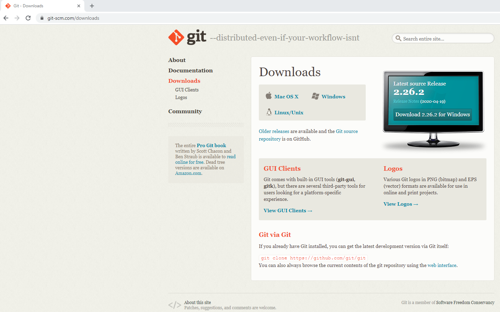
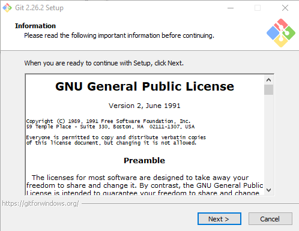
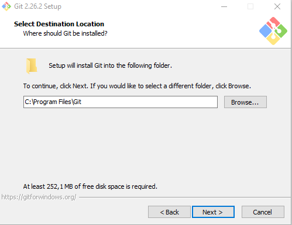
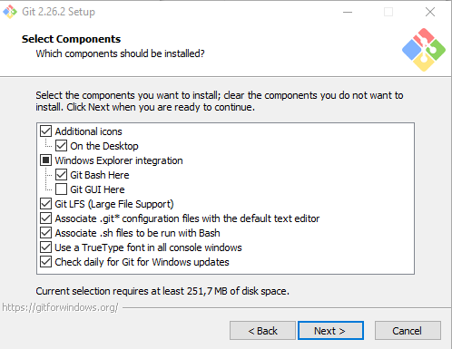
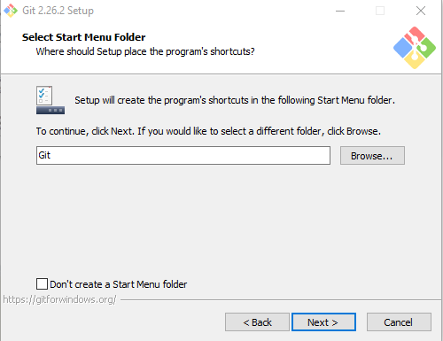
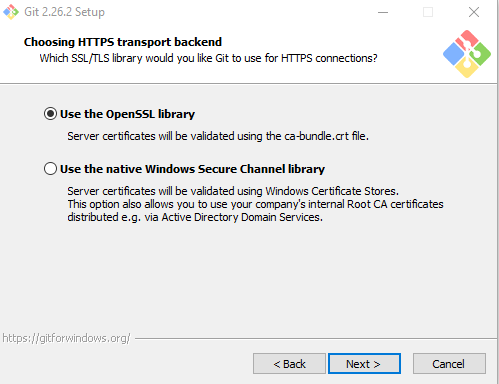

## Comece fazendo o [download](https://git-scm.com/download/win "Clique aqui!"){:target="_blank"}
---

#### Após ter concluído o download siga os passos para a instalação.

                                                 
  

   

  

   

  

  

  

   

  

  

 

  
 
 

## Instalação do **[P4Merge](https://www.perforce.com/downloads/visual-merge-tool "Clique aqui!"){:target="_blank"}** - Ferramenta para fazer o Merge
---------
 

 
* Após fazer o Download comece a instalar mas apenas marque a opção **Merge and Diff Tool (P4Merge)** 

   

 

 

 
