## Comece fazendo [download](https://git-scm.com/downloads "Clique aqui!")

#### Após ter concluído o download siga os passos para a instalação.

                                                 
 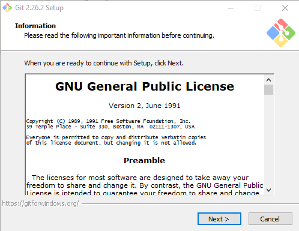 

 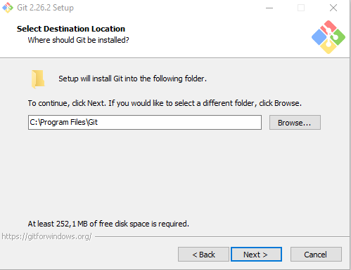  

 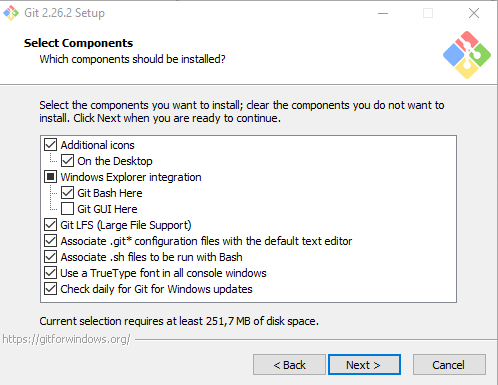 

 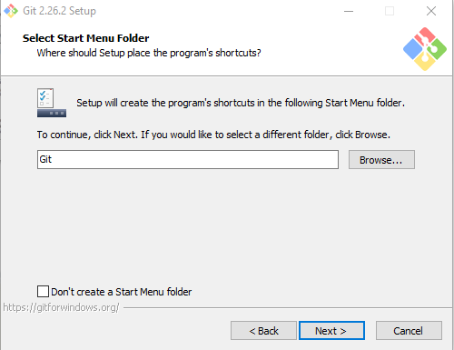  

 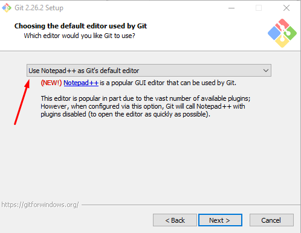 

 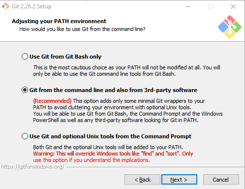 

 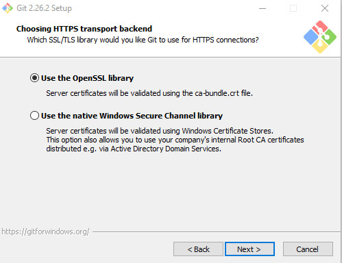 

 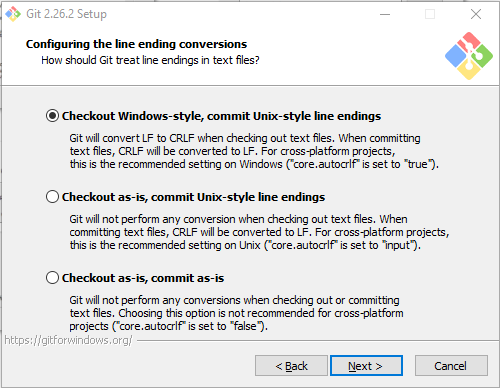  

 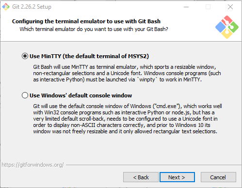 

 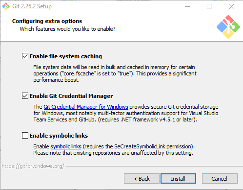 

 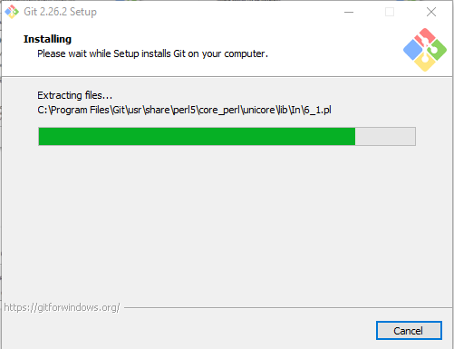

 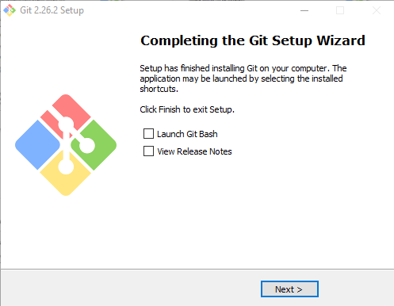 
 
