## Instruções por linha de comando

> **Com o botão direito do mouse em uma pasta de Projetos clique em "Git Bash Here" conforme a imagem abaixo:**
> 
> 

> **Com o bash aberto começaremos a digitar as configurações**
>
> 


* Git global setup:
```cmd
git config --global user.name 'seuNome'
git config --global user.email 'seuEmail'
```
<br />

* Para verificar se seu Nome e Email estão configurados digite:
```cmd
git config --list
```


<br />

### Clonando o Projeto para a sua máquina com HTTP - Opção 1
---
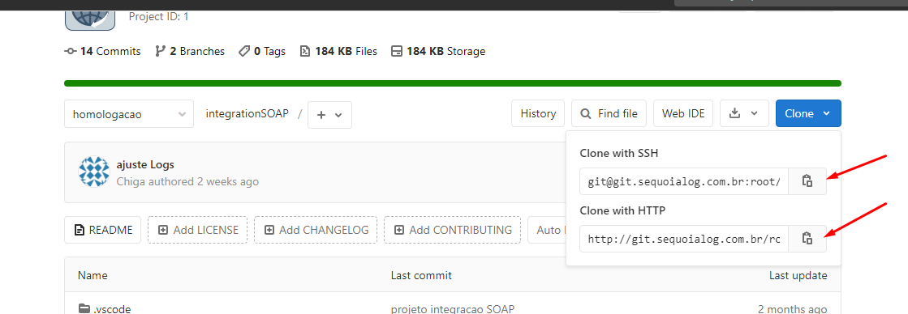

* No bash digite:
  
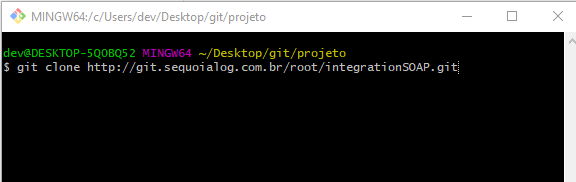
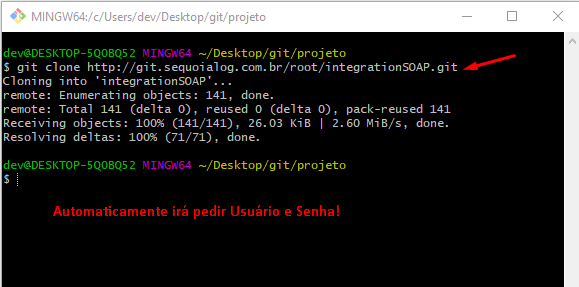
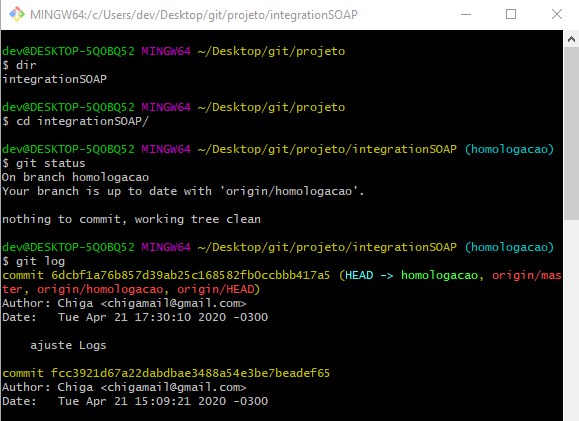

<br />
<br />

### Clonando o Projeto para a sua máquina com SSH - Opção 2
---
* Iremos criar sua senha **ssh** criptografada
```cmd
ssh-keygen -t rsa -C 'seuEmail'
```

* Em seguia apenas pressione [Enter] para todas as perguntas
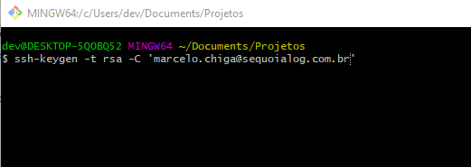  
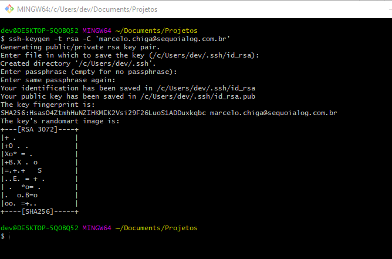

* Agora navegue até a pasta selecionada na imagem acima:
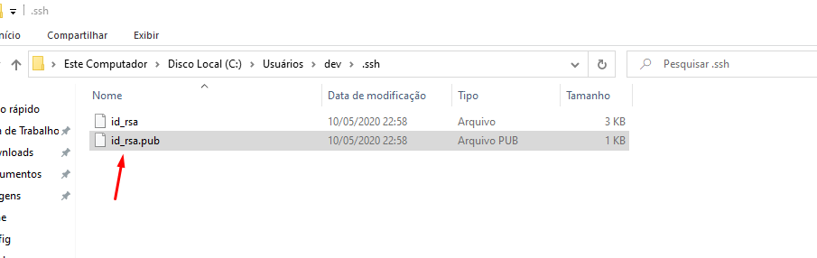

* Abra com um editor de texto e copie todo o conteúdo.
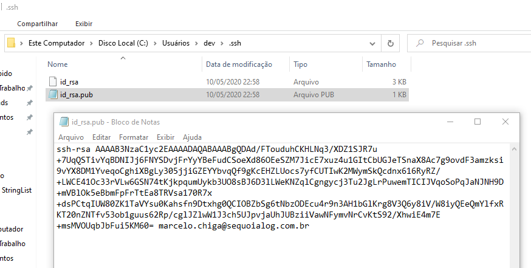

* Em seguida iremos Colar este conteúdo aqui:
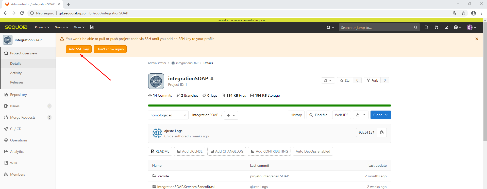
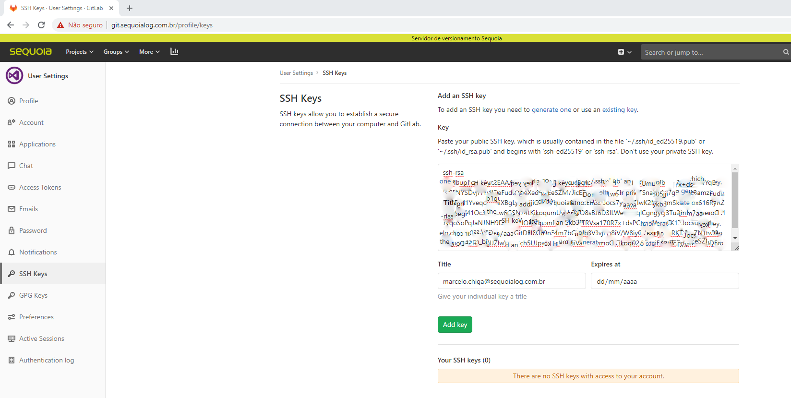
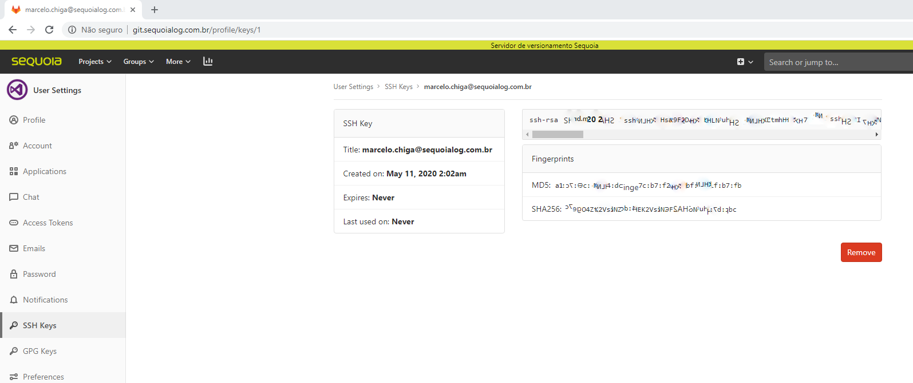


